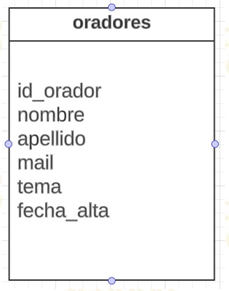
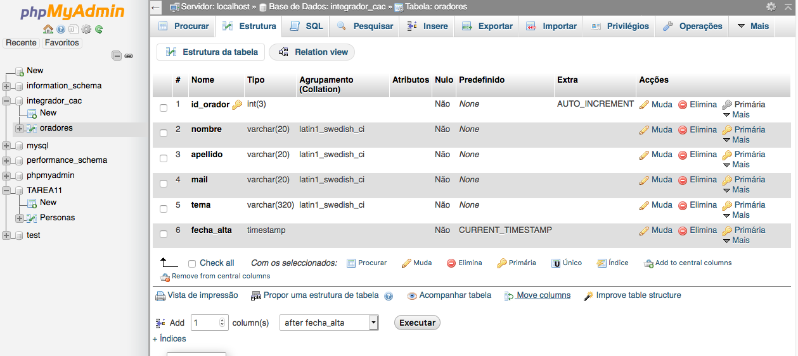
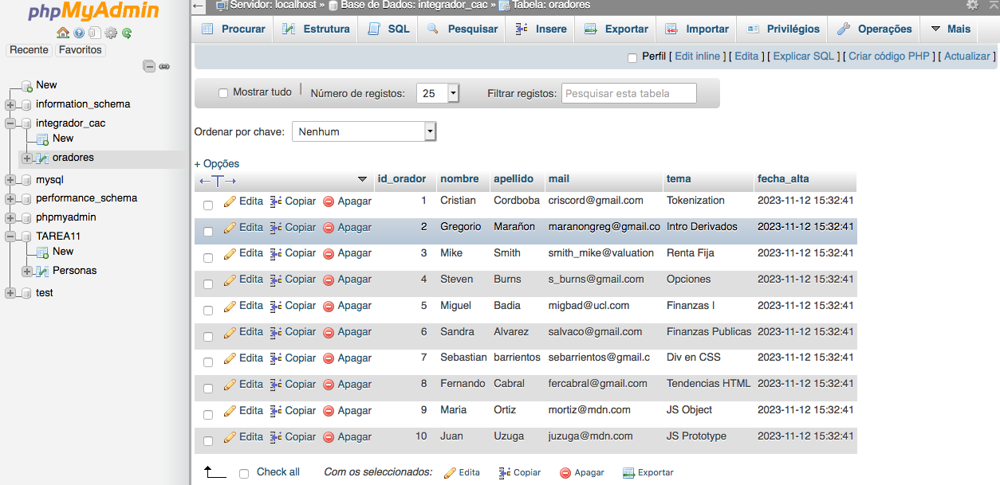

# TP_Integrador_BD
Solución Ejercicio BD Codo a Codo Comisión 23548

## Trabajo Práctico Integrador Base de Datos

Se deberá crear una base de datos llamada “integrador_cac” y crear la siguiente tabla llamada “oradores”:

1. Definir los tipos de datos correspondientes
1. Definir la clave primaria correspondiente
1. Definir las restricciones correspondientes
1. Insertar 10 registros
1. Hacer un backup de la base de datos

La entrega deberá ser subiendo el Backup de la base de datos, una captura de la estructura de la tabla y una captura de los registros insertados a un repositorio de Github y luego compartir el enlace.

## Solución

### Estructura Tabla

### Registros Tabla

### Archivo Backup
Vease archivo [Archivo Backup](./oradores.sql)
